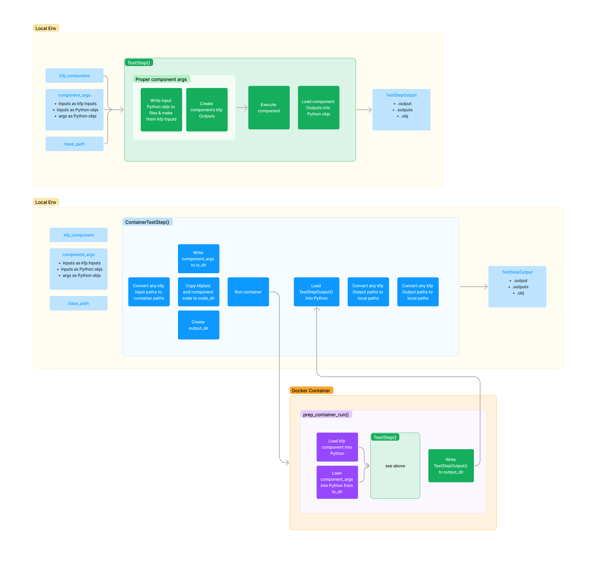

# kfptest
A module for running your kfp components locally and making them easy to test. Components can be run using a local environment or from their base_image Docker container.

## Installation
```
pip install git+https://github.com/ajosanchez/kfptest.git
```

OR 

```
git clone https://github.com/ajosanchez/kfptest.git
cd kfptest
pip install .
```

## Usage
### Test KFP Component by Running in Local Environment
```python
# test_component.py

from typing import NamedTuple

from kfp.dsl import component, Input, Output, Dataset

from kfptest import TestStep, ContainerTestStep


@component(base_image="python:3.10-slim")
def example_component(
    firstname: str, 
    lastname: str,
    input_dataset: Input[Dataset], 
    output_dataset: Output[Dataset]) -> NamedTuple(
    "Outputs",
    [
        ("full_name", str),
        ("squared_dataset", str),
    ]):
    from collections import namedtuple
    import pickle

    with open(input_dataset.path, "rb") as f:
        input_data = pickle.load(f)
    z = [x**2 for x in input_data]
    with open(output_dataset.path, "wb") as f:
        pickle.dump(z, f)
    outputs = namedtuple("Outputs", ["full_name", "squared_dataset"])
    return outputs(f"{firstname} {lastname}", z)


def test_example_component(tmp_path):
  component_args = {
    "firstname": "Jeffrey",
    "lastname": "Lebowski",
    "input_dataset": [1,2,3,4,5]
  }

  test_step = TestStep(example_component, component_args, tmp_path)
  test_run = test_step.run()

  assert test_run.obj["full_name"] == "Jeffrey Lebowski"
  assert test_run.obj["squared_dataset"] == [1, 4, 9, 16, 25]
```
```bash
pytest test_component
```
### Test KFP Component by Running It in a Docker Container 
If the components has a `base_image` specified it can also be run from a container based off that image.

```python
def test_example_component(tmp_path):
  component_args = {
    "firstname": "Jeffrey",
    "lastname": "Lebowski",
    "input_dataset": [1,2,3,4,5]
  }

  test_step = ContainerTestStep(example_component, component_args, tmp_path)
  test_run = test_step.run()

  assert test_run.obj["full_name"] == "Jeffrey Lebowski"
  assert test_run.obj["squared_dataset"] == [1, 4, 9, 16, 25]
```

```bash
pytest test_component.py
```

## Some nice features of kfptest
* The output of a `TestStep` or `ContainerTestStep` run is a `NamedTuple` with `.output` and/or `.outputs` attributes that work just like kfp components
* The output of a `TestStep` or `ContainerTestStep` also has a `.obj` attribute which returns a dict of the outputs as the actual Python objects for easy testing and debugging
* Every `TestStep` or `ContainerTestStep` takes a base_path which can be a pytest `temp_path` for easy and clean testing

## Some things to keep in mind
* In order to test a component in its base_image container:
  1. Custom images must already built on your machine
  2. kfptest must have kfp installed in the container when testing the component. By default, kfptest will attempt to `pip install kfp` before running the component which takes about 15 seconds if it's not already installed. This also means that pip must be available for use in the base_image.
* Currently works with kfp 2.3.0

## Diagram

